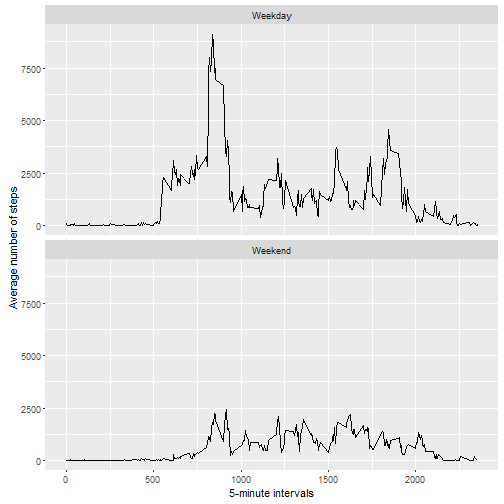

## Loading and preprocessing the data


```r
data <- read.csv("activity.csv", colClasses = "character")
data$steps <- as.numeric(data$steps)
data$interval <- as.numeric(data$interval)
```

## What is mean total number of steps taken per day?

For this part of the assignment, you can ignore the missing values in the dataset.

1. Calculate the total number of steps taken per day


```r
library(ggplot2)
totalSteps <- tapply(as.numeric(data$steps), data$date, sum, na.rm = TRUE)
totalSteps <- data.frame(Steps = totalSteps, Date = names(totalSteps))
print(totalSteps)
```

```
##            Steps       Date
## 2012-10-01     0 2012-10-01
## 2012-10-02   126 2012-10-02
## 2012-10-03 11352 2012-10-03
## 2012-10-04 12116 2012-10-04
## 2012-10-05 13294 2012-10-05
## 2012-10-06 15420 2012-10-06
## 2012-10-07 11015 2012-10-07
## 2012-10-08     0 2012-10-08
## 2012-10-09 12811 2012-10-09
## 2012-10-10  9900 2012-10-10
## 2012-10-11 10304 2012-10-11
## 2012-10-12 17382 2012-10-12
## 2012-10-13 12426 2012-10-13
## 2012-10-14 15098 2012-10-14
## 2012-10-15 10139 2012-10-15
## 2012-10-16 15084 2012-10-16
## 2012-10-17 13452 2012-10-17
## 2012-10-18 10056 2012-10-18
## 2012-10-19 11829 2012-10-19
## 2012-10-20 10395 2012-10-20
## 2012-10-21  8821 2012-10-21
## 2012-10-22 13460 2012-10-22
## 2012-10-23  8918 2012-10-23
## 2012-10-24  8355 2012-10-24
## 2012-10-25  2492 2012-10-25
## 2012-10-26  6778 2012-10-26
## 2012-10-27 10119 2012-10-27
## 2012-10-28 11458 2012-10-28
## 2012-10-29  5018 2012-10-29
## 2012-10-30  9819 2012-10-30
## 2012-10-31 15414 2012-10-31
## 2012-11-01     0 2012-11-01
## 2012-11-02 10600 2012-11-02
## 2012-11-03 10571 2012-11-03
## 2012-11-04     0 2012-11-04
## 2012-11-05 10439 2012-11-05
## 2012-11-06  8334 2012-11-06
## 2012-11-07 12883 2012-11-07
## 2012-11-08  3219 2012-11-08
## 2012-11-09     0 2012-11-09
## 2012-11-10     0 2012-11-10
## 2012-11-11 12608 2012-11-11
## 2012-11-12 10765 2012-11-12
## 2012-11-13  7336 2012-11-13
## 2012-11-14     0 2012-11-14
## 2012-11-15    41 2012-11-15
## 2012-11-16  5441 2012-11-16
## 2012-11-17 14339 2012-11-17
## 2012-11-18 15110 2012-11-18
## 2012-11-19  8841 2012-11-19
## 2012-11-20  4472 2012-11-20
## 2012-11-21 12787 2012-11-21
## 2012-11-22 20427 2012-11-22
## 2012-11-23 21194 2012-11-23
## 2012-11-24 14478 2012-11-24
## 2012-11-25 11834 2012-11-25
## 2012-11-26 11162 2012-11-26
## 2012-11-27 13646 2012-11-27
## 2012-11-28 10183 2012-11-28
## 2012-11-29  7047 2012-11-29
## 2012-11-30     0 2012-11-30
```

2. If you do not understand the difference between a histogram and a barplot, research the difference between them. Make a histogram of the total number of steps taken each day


```r
hist(totalSteps$Steps, xlab = "Total number of steps", main = "Histogram of total number of steps per day",
     col = "light blue", ylim = c(0,30))
```


 
3.Calculate and report the mean and median of the total number of steps taken per day


```r
meanvalue <- format(round(mean(totalSteps$Steps), 2), nsmall = 2)
median <- as.integer(median(totalSteps$Steps))
```

The mean is: 9354.23

The median is: 10395

## What is the average daily activity pattern?

Make a time series plot (i.e. type = "l") of the 5-minute interval (x-axis) and the average number of steps taken, averaged across all days (y-axis)


```r
averageSteps <- tapply(as.numeric(data$steps), data$interval, mean, na.rm = TRUE)
averageSteps <- data.frame(Steps = averageSteps, Interval = as.numeric(names(averageSteps)))
plot(averageSteps$Interval,averageSteps$Steps, type = "l", ylab = "Average number of steps", xlab="5-minute intervals", main = "Average number of steps across 5-minute intervals")
```


Which 5-minute interval, on average across all the days in the dataset, contains the maximum number of steps?


```r
orderedAverageSteps <- averageSteps[order(-averageSteps$Steps),]
max <- orderedAverageSteps[1,2]
```

The 5-minute interval with the maximum number of steps is: 835 

##Imputing missing values

Note that there are a number of days/intervals where there are missing values (coded as NA). The presence of missing days may introduce bias into some calculations or summaries of the data.

1. Calculate and report the total number of missing values in the dataset (i.e. the total number of rows with NAs)


```r
incompleteRows <- nrow(data[!complete.cases(data),])
```

The total number of rows with NAs is: 2304

2. Devise a strategy for filling in all of the missing values in the dataset. The strategy does not need to be sophisticated. For example, you could use the mean/median for that day, or the mean for that 5-minute interval, etc.

3. Create a new dataset that is equal to the original dataset but with the missing data filled in.


```r
##I decided to fill in NA values with the mean of the steps for the days with NA values, with is 0 for all of them
for(i in 1:nrow(data)){
  if(is.na(data[i,])) {data$steps[i] = 0 }
}
```


4. Make a histogram of the total number of steps taken each day and Calculate and report the mean and median total number of steps taken per day. Do these values differ from the estimates from the first part of the assignment? What is the impact of imputing missing data on the estimates of the total daily number of steps?


```r
totalSteps2 <- tapply(as.numeric(data$steps), data$date, sum, na.rm = TRUE)
totalSteps2 <- data.frame(Steps = totalSteps2, Date = names(totalSteps2))
meanvalue2 <- format(round(mean(totalSteps$Steps), 2), nsmall = 2)
median2 <- as.integer(median(totalSteps$Steps))
hist(totalSteps2$Steps, xlab = "Total number of steps", main = "Histogram of total number of steps per day",
     col = "light blue", ylim = c(0,30))
```


The mean is: 9354.23

The median is: 10395

The mean and median values did not differ from those of the first part of the assignment. I decided to use the average number of steps for each day to fill in missing values, but since there was no step data for those days with missing values, the NAs were replaced with 0, and that had no impact on the estimates.

## Are there differences in activity patterns between weekdays and weekends?

For this part the weekdays() function may be of some help here. Use the dataset with the filled-in missing values for this part.

1. Create a new factor variable in the dataset with two levels - "weekday" and "weekend" indicating whether a given date is a weekday or weekend day.


```r
data$date <- as.Date(data$date,format("%Y-%m-%d"))
data$date <- weekdays(data$date, abbreviate = FALSE)

data$date <- gsub("Monday","Weekday", data$date)
data$date <- gsub("Tuesday","Weekday", data$date)
data$date <- gsub("Wednesday","Weekday", data$date)
data$date <- gsub("Thursday","Weekday", data$date)
data$date <- gsub("Friday","Weekday", data$date)
data$date <- gsub("Saturday","Weekend", data$date)
data$date <- gsub("Sunday","Weekend", data$date)

data <- transform(data, date = factor(date))
```
2. Make a panel plot containing a time series plot (i.e. type = "l") of the 5-minute interval (x-axis) and the average number of steps taken, averaged across all weekday days or weekend days (y-axis). See the README file in the GitHub repository to see an example of what this plot should look like using simulated data.


```r
library(ggplot2)
library(reshape2)
```

```
## Warning: package 'reshape2' was built under R version 3.2.5
```

```r
averageSteps2 <- xtabs(steps ~ interval + date, data = data)
averageSteps2 <- melt(averageSteps2, id = c("interval","date"))
ggplot(averageSteps2, aes(x = interval, y = value)) + geom_line() + facet_wrap(~date, nrow=2) + labs( x = "5-minute intervals", y = "Average number of steps")
```


